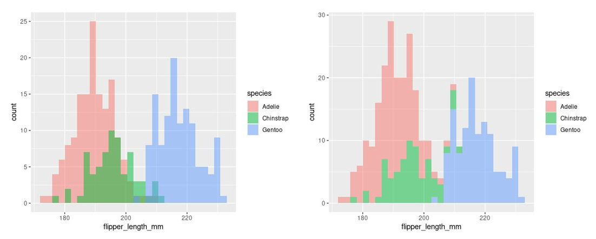

# **University Coding**

This repository contains work I completed during BSc Zoology at Queen Mary University of London.

## Data visualisation examples

## I can also add a link to a [folder](./my_plots)

If I want the link in normal text that's [fine](./my_plots), too.

### There are different header levels

I can have text in **bold** or in *italics*. 
If I want I can even add a table!

|**Week**     |**Topic**  |**Functions**  |
|:------------|:----------|:--------------|
| *Week 1*    |Intro      |rep()          |
| *Week 2*    |Regex      |gsub()         |             
